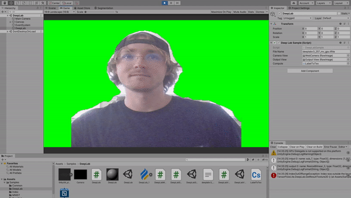
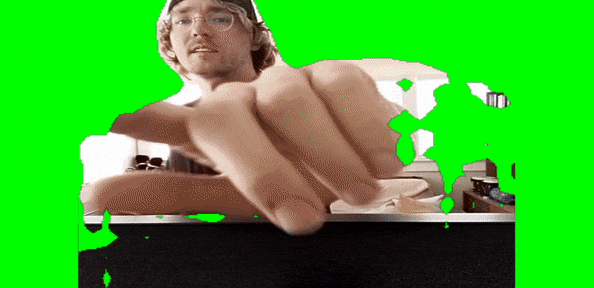

# Body Segmentation 

Crop out the background of your webcam in real time with a machine learning tool. A [body segmentation](https://www.tensorflow.org/lite/models/segmentation/overview) algorithm is used on the webcam feed to differentiate between people and not. The app is built with Unity using the universal render pipline and is compatible with Android and iOS. 

Tested on Windows
Unity 2019.3

Tested on Android Pixel 3a

https://gfycat.com/farflungfelinekoi

For more TensorFlow Examples please see : https://github.com/asus4/tf-lite-unity-sample 
